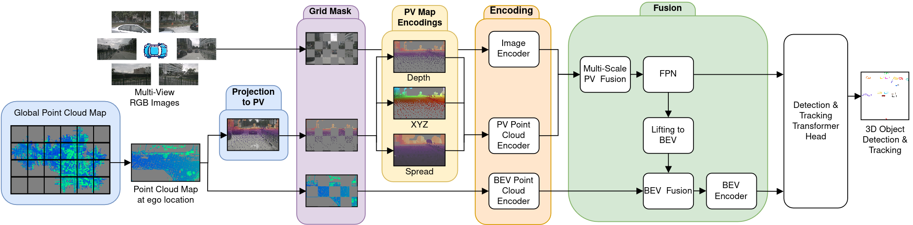

# DualViewMapDet - Leveraging Previous-Traversal Point Cloud Map Priors for Camera-Based 3D Object Detection and Tracking

[**arXiv**](https://arxiv.org/abs/2604.25405) | [**Website**](http://dualviewmapdet.cs.uni-freiburg.de/) | [**Video**](https://youtu.be/J1msvf0qv1I)

This repository is the official implementation of the paper:

> **Leveraging Previous-Traversal Point Cloud Map Priors for
Camera-Based 3D Object Detection and Tracking**
>
> [Markus Käppeler](https://rl.uni-freiburg.de/people/kaeppelm), Özgün Cicek, Yakov Miron, and [Abhinav Valada](https://rl.uni-freiburg.de/people/valada). <br>
>
>

<p align="center">
  
</p>

If you find our work useful in your research or applications, please consider giving us a star or citing our paper:
```
@article{kaeppeler2026dvmd,
      author={Käppeler, Markus and Çiçek, Özgün and Miron, Yakov and Valada, Abhinav},
      title={Leveraging Previous-Traversal Point Cloud Map Priors for Camera-Based 3D Object Detection and Tracking}, 
      journal={IEEE/RSJ International Conference on Intelligent Robots and Systems (IROS)},
      year={2026},
}
```

## News
* **`17 June, 2026`:** DualViewMapDet was accepted at IEEE/RSJ International Conference on Intelligent Robots and Systems (IROS) 2026. We will release the code soon. Stay tuned!


## 📔 Abstract
Camera-based 3D object detection and tracking are central to autonomous driving, yet precise 3D object localization remains fundamentally constrained by depth ambiguity when no expensive, depth-rich online LiDAR is available at inference. In many deployments, however, vehicles repeatedly traverse the same environments, making static point cloud maps from prior traversals a practical source of geometric priors. We propose DualViewMapDet, a camera-only inference framework that retrieves such map priors online and leverages them to mitigate the absence of a LiDAR sensor during deployment. The key idea is a dual-space camera-map fusion strategy that avoids one-sided view conversion. Specifically, we (i) project the map into perspective view (PV) and encode multi-channel geometric cues to enrich image features and support BEV lifting, and (ii) encode the map directly in bird's-eye view (BEV) with a sparse voxel backbone and fuse it with lifted camera features in a shared metric space. Extensive evaluations on nuScenes and Argoverse 2 demonstrate consistent improvements over strong camera-only baselines, with particularly strong gains in object localization. Ablations further validate the contributions of PV/BEV fusion and prior-map coverage.


## Purpose of the project

This software is a research prototype, solely developed for and published as part of the publication [**Leveraging Previous-Traversal Point Cloud Map Priors for Camera-Based 3D Object Detection and Tracking**](https://arxiv.org/abs/2604.25405) . It will neither be maintained nor monitored in any way.

## 🙏 Acknowledgment

This research was funded by Bosch Research as part of a collaboration between Bosch Research and the University of Freiburg on AI-based automated driving. 

- [SparseDrive](https://github.com/swc-17/SparseDrive)
- [Sparse4D](https://github.com/HorizonRobotics/Sparse4D)
- [BEVNeXt](https://github.com/woxihuanjiangguo/BEVNeXt)
- [SparseBEV](https://github.com/MCG-NJU/SparseBEV)
- [Far3D](https://github.com/megvii-research/Far3D)
- [BEVFusion](https://github.com/mit-han-lab/bevfusion)
- [LT3D](https://github.com/neeharperi/LT3D)
- [mmdet3d](https://github.com/open-mmlab/mmdetection3d)


